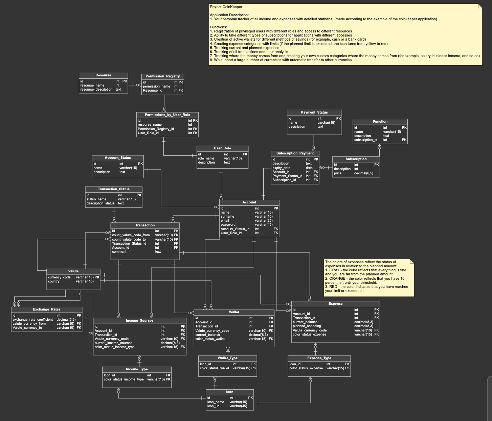

# CoinKeeper_Project_PL_SQL

# Project Overview: CoinKeeper - Personal Finance Management System

## Description:

CoinKeeper is a comprehensive personal finance management system designed to empower users with effective tools for tracking and optimizing their financial activities. The application covers a wide range of features, facilitating budgeting, expense tracking, income management, and subscription handling.

## Key Features:

- Account Creation: Users can create accounts by providing essential information such as name, surname, email, and password.
User Roles: Different user roles (e.g., regular user, administrator) provide varying levels of access and permissions.
Financial Transactions:

- Expense Tracking: Users can record their daily expenses, including transaction details, amounts, and categories.
Income Management: Record and categorize various sources of income to gain a comprehensive view of financial inflows.
Currency Exchange:

- Real-Time Exchange Rates: Utilizes real-time exchange rates to convert and display transactions in the user's preferred currency.
Exchange Rate Coefficients: Exchange rates are stored in the system, ensuring accurate currency conversion.
Subscription Management:

- Subscription Plans: Users can subscribe to different plans, each associated with specific features and prices.
Payment Status: Tracks subscription payments, including statuses and expiration dates.
Wallets and Accounts:

- Wallet Management: Users can create and manage multiple wallets, each associated with specific currencies and color-coded statuses.
Account Status: Monitors account statuses to keep users informed about their financial standing.
Transaction Status:

- Transaction Monitoring: Tracks the status of financial transactions, providing insights into pending, completed, or failed transactions.
Expense and Income Types:

- Expense Categories: Categorizes expenses into different types, allowing users to analyze spending patterns.
Income Categories: Categorizes income sources, providing a breakdown of income streams.
Icons and Visual Representations:

- Icon Library: Utilizes an extensive library of icons to visually represent expense, income, and wallet types.
Color-Coded Status: Uses color-coded statuses to quickly convey information about transactions, wallets, and subscription plans.
Permissions and Access Control:

- User Role Permissions: Assigns specific permissions to user roles, ensuring secure and controlled access to features.
Permission Registry: Maintains a registry of permissions for various resources within the application.
Dashboard and Reporting:

- User-Friendly Dashboard: Presents users with an intuitive dashboard summarizing key financial metrics and trends.
Graphical Representations: Utilizes graphs and charts to visually represent financial data for easy analysis.
Target Users:

- Individuals looking to gain better control over their personal finances.
Finance enthusiasts wanting detailed insights into their spending and saving habits.
Users who appreciate a visually appealing and user-friendly interface for financial management.
CoinKeeper aims to empower users by providing a holistic and intuitive solution for managing personal finances, promoting financial awareness and responsible spending.
